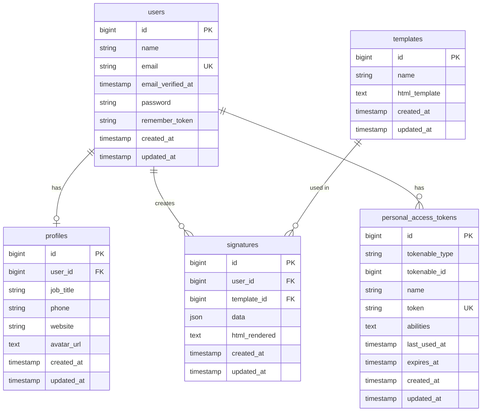

# Database Schema - Email Signature Generator

## Database Diagram

### Entity Relationship Diagram (ER Diagram)



### Visual Database Schema (dbdiagram.io style)

```
┌─────────────────────────────────────────────┐
│              users                          │
├─────────────────────────────────────────────┤
│ 🔑 id                    bigint PK         │
│    name                  varchar(255)       │
│ ⭐ email                 varchar(255) UK   │
│    email_verified_at     timestamp          │
│    password              varchar(255)       │
│    remember_token        varchar(100)       │
│    created_at            timestamp          │
│    updated_at            timestamp          │
└─────────────────────────────────────────────┘
         │                           │
         │                           │
         │ 1:1                       │ 1:n
         │ has_one                   │ has_many
         │                           │
         ▼                           ▼
┌─────────────────────────────┐   ┌─────────────────────────────────────────────┐
│      profiles               │   │           signatures                        │
├─────────────────────────────┤   ├─────────────────────────────────────────────┤
│ 🔑 id           bigint PK  │   │ 🔑 id              bigint PK               │
│ 🔗 user_id      bigint FK  │───│ 🔗 user_id         bigint FK               │
│    job_title    varchar    │   │ 🔗 template_id     bigint FK               │───┐
│    phone        varchar    │   │    data            json                     │   │
│    website      varchar    │   │    html_rendered   text                     │   │
│    avatar_url   text       │   │    created_at      timestamp                │   │
│    created_at   timestamp  │   │    updated_at      timestamp                │   │
│    updated_at   timestamp  │   └─────────────────────────────────────────────┘   │
└─────────────────────────────┘                                                     │
                                                                                    │
                                                                                    │
         ┌──────────────────────────────────────────────────────────────────────────┘
         │ n:1
         │ belongs_to
         │
         ▼
┌─────────────────────────────────────────────┐
│              templates                      │
├─────────────────────────────────────────────┤
│ 🔑 id                bigint PK             │
│    name              varchar(255)           │
│    html_template     text                   │
│    created_at        timestamp              │
│    updated_at        timestamp              │
└─────────────────────────────────────────────┘


         users (1) ────────────┐
                               │ 1:n (polymorphic)
                               │ has_many
                               │
                               ▼
         ┌─────────────────────────────────────────────────────────┐
         │         personal_access_tokens (Sanctum)                │
         ├─────────────────────────────────────────────────────────┤
         │ 🔑 id                    bigint PK                      │
         │ 🔗 tokenable_type        varchar(255)  ─┐               │
         │ 🔗 tokenable_id          bigint         ├─ Polymorphic  │
         │    name                  varchar(255)   │               │
         │ ⭐ token                 varchar(64) UK │               │
         │    abilities             text           │               │
         │    last_used_at          timestamp      │               │
         │    expires_at            timestamp      │               │
         │    created_at            timestamp      │               │
         │    updated_at            timestamp      │               │
         └─────────────────────────────────────────────────────────┘
```

### Detailed Table Relationships

```
┏━━━━━━━━━━━━━━━━━━━━━━━━━━━━━━━━━━━━━━━━━━━━━━━━━━━━━━━━━━━━━━━━━━━━━━━━━━━━┓
┃                          RELATIONSHIP MAP                                      ┃
┗━━━━━━━━━━━━━━━━━━━━━━━━━━━━━━━━━━━━━━━━━━━━━━━━━━━━━━━━━━━━━━━━━━━━━━━━━━━━┛


              ╔═══════════════════════════════════════╗
              ║           👤 USERS                    ║
              ║  ─────────────────────────────────   ║
              ║  PK: id                               ║
              ║  UK: email                            ║
              ║  Fields: name, password, etc.         ║
              ╚═══════════════════════════════════════╝
                     │              │             │
                     │              │             │
          ┌──────────┘              │             └──────────┐
          │                         │                        │
          │ 1:1                     │ 1:n                    │ 1:n (polymorphic)
          │ ON DELETE CASCADE       │ ON DELETE CASCADE      │
          │                         │                        │
          ▼                         ▼                        ▼
  ┌───────────────────┐   ┌────────────────────┐   ┌────────────────────────┐
  │   📋 PROFILES     │   │  ✍️  SIGNATURES    │   │  🔐 TOKENS             │
  │   ──────────────  │   │   ───────────────  │   │   ──────────────────   │
  │   PK: id          │   │   PK: id           │   │   PK: id               │
  │   FK: user_id  ───┼──▶│   FK: user_id ─────┼──▶│   FK: tokenable_id ────┤
  │   UQ: user_id     │   │   FK: template_id  │   │   UK: token            │
  └───────────────────┘   └────────┬───────────┘   │   Fields: name, etc.   │
                                   │                └────────────────────────┘
                                   │ n:1
                                   │ ON DELETE CASCADE
                                   │
                                   ▼
                          ┌────────────────────┐
                          │  📄 TEMPLATES      │
                          │  ───────────────   │
                          │  PK: id            │
                          │  Fields: name,     │
                          │  html_template     │
                          └────────────────────┘


╔════════════════════════════════════════════════════════════════════════════╗
║                       FOREIGN KEY CONSTRAINTS                              ║
╠════════════════════════════════════════════════════════════════════════════╣
║                                                                            ║
║  profiles.user_id  ───────▶  users.id        [1:1, CASCADE DELETE]       ║
║                                                                            ║
║  signatures.user_id  ─────▶  users.id        [1:n, CASCADE DELETE]       ║
║                                                                            ║
║  signatures.template_id  ─▶  templates.id    [n:1, CASCADE DELETE]       ║
║                                                                            ║
║  personal_access_tokens   ─▶  users.id       [1:n, Polymorphic]          ║
║  (tokenable_type + id)                                                     ║
║                                                                            ║
╚════════════════════════════════════════════════════════════════════════════╝
```

### Table Details with Indexes

```
┌──────────────────────────────────────────────────────────────────────────────┐
│ TABLE: users                                                      [8 columns] │
├──────────────────────────────────────────────────────────────────────────────┤
│ Column              │ Type          │ Attributes                              │
├─────────────────────┼───────────────┼─────────────────────────────────────────┤
│ 🔑 id               │ BIGINT        │ PRIMARY KEY, AUTO_INCREMENT             │
│    name             │ VARCHAR(255)  │ NOT NULL                                │
│ 📧 email            │ VARCHAR(255)  │ NOT NULL, UNIQUE INDEX                  │
│    email_verified_at│ TIMESTAMP     │ NULL                                    │
│ 🔒 password         │ VARCHAR(255)  │ NOT NULL, HASHED (bcrypt)               │
│    remember_token   │ VARCHAR(100)  │ NULL                                    │
│ 📅 created_at       │ TIMESTAMP     │ NULL                                    │
│ 📅 updated_at       │ TIMESTAMP     │ NULL                                    │
└──────────────────────────────────────────────────────────────────────────────┘
  Indexes: PRIMARY KEY (id), UNIQUE (email)
  Relationships: 1 profile, many signatures, many tokens


┌──────────────────────────────────────────────────────────────────────────────┐
│ TABLE: profiles                                                   [8 columns] │
├──────────────────────────────────────────────────────────────────────────────┤
│ Column              │ Type          │ Attributes                              │
├─────────────────────┼───────────────┼─────────────────────────────────────────┤
│ 🔑 id               │ BIGINT        │ PRIMARY KEY, AUTO_INCREMENT             │
│ 🔗 user_id          │ BIGINT        │ NOT NULL, FOREIGN KEY → users(id)       │
│                     │               │ UNIQUE, ON DELETE CASCADE               │
│    job_title        │ VARCHAR(255)  │ NULL                                    │
│    phone            │ VARCHAR(50)   │ NULL                                    │
│    website          │ VARCHAR(255)  │ NULL                                    │
│    avatar_url       │ TEXT          │ NULL (supports data URIs)               │
│ 📅 created_at       │ TIMESTAMP     │ NULL                                    │
│ 📅 updated_at       │ TIMESTAMP     │ NULL                                    │
└──────────────────────────────────────────────────────────────────────────────┘
  Indexes: PRIMARY KEY (id), UNIQUE (user_id), INDEX (user_id)
  Relationships: belongs_to User


┌──────────────────────────────────────────────────────────────────────────────┐
│ TABLE: templates                                                  [5 columns] │
├──────────────────────────────────────────────────────────────────────────────┤
│ Column              │ Type          │ Attributes                              │
├─────────────────────┼───────────────┼─────────────────────────────────────────┤
│ 🔑 id               │ BIGINT        │ PRIMARY KEY, AUTO_INCREMENT             │
│    name             │ VARCHAR(255)  │ NOT NULL                                │
│    html_template    │ TEXT          │ NOT NULL (HTML with {{placeholders}})  │
│ 📅 created_at       │ TIMESTAMP     │ NULL                                    │
│ 📅 updated_at       │ TIMESTAMP     │ NULL                                    │
└──────────────────────────────────────────────────────────────────────────────┘
  Indexes: PRIMARY KEY (id)
  Relationships: has_many Signatures
  Note: Seeded with 3 default templates


┌──────────────────────────────────────────────────────────────────────────────┐
│ TABLE: signatures                                                 [8 columns] │
├──────────────────────────────────────────────────────────────────────────────┤
│ Column              │ Type          │ Attributes                              │
├─────────────────────┼───────────────┼─────────────────────────────────────────┤
│ 🔑 id               │ BIGINT        │ PRIMARY KEY, AUTO_INCREMENT             │
│ 🔗 user_id          │ BIGINT        │ NOT NULL, FOREIGN KEY → users(id)       │
│                     │               │ INDEX, ON DELETE CASCADE                │
│ 🔗 template_id      │ BIGINT        │ NOT NULL, FOREIGN KEY → templates(id)   │
│                     │               │ INDEX, ON DELETE CASCADE                │
│    data             │ JSON          │ NOT NULL {full_name, job_title, etc.}   │
│    html_rendered    │ TEXT          │ NOT NULL (rendered HTML output)         │
│ 📅 created_at       │ TIMESTAMP     │ NULL                                    │
│ 📅 updated_at       │ TIMESTAMP     │ NULL                                    │
└──────────────────────────────────────────────────────────────────────────────┘
  Indexes: PRIMARY KEY (id), INDEX (user_id), INDEX (template_id)
  Relationships: belongs_to User, belongs_to Template


┌──────────────────────────────────────────────────────────────────────────────┐
│ TABLE: personal_access_tokens (Laravel Sanctum)                 [10 columns] │
├──────────────────────────────────────────────────────────────────────────────┤
│ Column              │ Type          │ Attributes                              │
├─────────────────────┼───────────────┼─────────────────────────────────────────┤
│ 🔑 id               │ BIGINT        │ PRIMARY KEY, AUTO_INCREMENT             │
│ 🔗 tokenable_type   │ VARCHAR(255)  │ NOT NULL (e.g., 'App\Models\User')      │
│ 🔗 tokenable_id     │ BIGINT        │ NOT NULL (user id)                      │
│                     │               │ INDEX (tokenable_type, tokenable_id)    │
│    name             │ VARCHAR(255)  │ NOT NULL (e.g., 'auth_token')           │
│ 🔐 token            │ VARCHAR(64)   │ NOT NULL, UNIQUE INDEX, HASHED          │
│    abilities        │ TEXT          │ NULL (JSON array of permissions)        │
│    last_used_at     │ TIMESTAMP     │ NULL                                    │
│    expires_at       │ TIMESTAMP     │ NULL                                    │
│ 📅 created_at       │ TIMESTAMP     │ NULL                                    │
│ 📅 updated_at       │ TIMESTAMP     │ NULL                                    │
└──────────────────────────────────────────────────────────────────────────────┘
  Indexes: PRIMARY KEY (id), UNIQUE (token), 
           INDEX (tokenable_type, tokenable_id)
  Relationships: morphTo User (polymorphic)
```

### Connection Flow Diagram

```
┌─────────────────────────────────────────────────────────────────────────────┐
│                         DATABASE OPERATION FLOW                             │
└─────────────────────────────────────────────────────────────────────────────┘

USER REGISTRATION:
  INSERT INTO users (name, email, password)
         ↓
  [Auto-generates user.id]
         ↓
  INSERT INTO profiles (user_id, ...) ← FOREIGN KEY: users.id
         ↓
  ✓ User account ready with empty profile

USER LOGIN:
  SELECT * FROM users WHERE email = ?
         ↓
  [Verify password]
         ↓
  INSERT INTO personal_access_tokens (tokenable_type, tokenable_id, token)
         ↓                             ↑
         └─────────────────────────────┘ FOREIGN KEY: users.id
         ↓
  ✓ Return Bearer token to client

SIGNATURE CREATION:
  SELECT * FROM templates WHERE id = ? ← User selects template
         ↓
  [User fills form data]
         ↓
  [Render: template.html_template + form data → html_rendered]
         ↓
  INSERT INTO signatures (user_id, template_id, data, html_rendered)
         ↓              ↑          ↑
         │              │          └──────── FOREIGN KEY: templates.id
         │              └─────────────────── FOREIGN KEY: users.id
         ↓
  ✓ Signature saved and ready to export

SIGNATURE RETRIEVAL:
  SELECT s.*, t.name, t.html_template, u.name
  FROM signatures s
  JOIN users u ON s.user_id = u.id ← FOREIGN KEY JOIN
  JOIN templates t ON s.template_id = t.id ← FOREIGN KEY JOIN
  WHERE s.user_id = ?
         ↓
  ✓ Returns signatures with template and user info

PROFILE UPDATE:
  SELECT p.* FROM profiles p
  JOIN users u ON p.user_id = u.id ← FOREIGN KEY JOIN
  WHERE u.id = ?
         ↓
  UPDATE profiles SET job_title = ?, phone = ?, ... WHERE user_id = ?
         ↓
  ✓ Profile updated

USER DELETION (CASCADE):
  DELETE FROM users WHERE id = ? 
         ↓
  [CASCADE DELETE triggers]
         ├─→ DELETE FROM profiles WHERE user_id = ?
         ├─→ DELETE FROM signatures WHERE user_id = ?
         └─→ DELETE FROM personal_access_tokens WHERE tokenable_id = ?
         ↓
  ✓ User and all related data removed
```

### Visual UI Form Representation

```
┏━━━━━━━━━━━━━━━━━━━━━━━━━━━━━━━━━━━━━━━━━━━━━━━━━━━━━━━━━━━━━━━━━━━━━━━━━━━━━━━━┓
┃                         📋 REGISTRATION FORM (users table)                        ┃
┣━━━━━━━━━━━━━━━━━━━━━━━━━━━━━━━━━━━━━━━━━━━━━━━━━━━━━━━━━━━━━━━━━━━━━━━━━━━━━━━━┫
┃                                                                                   ┃
┃  Full Name:     [_____________________________________________]  ← name          ┃
┃                                                                                   ┃
┃  Email:         [_____________________________________________]  ← email (unique) ┃
┃                                                                                   ┃
┃  Password:      [_____________________________________________]  ← password (hash)┃
┃                                                                                   ┃
┃                          [  Register  ]                                          ┃
┃                                                                                   ┃
┃  Auto-generated: id, email_verified_at, remember_token, created_at, updated_at   ┃
┗━━━━━━━━━━━━━━━━━━━━━━━━━━━━━━━━━━━━━━━━━━━━━━━━━━━━━━━━━━━━━━━━━━━━━━━━━━━━━━━━┛
                                      │
                                      │ Creates (1:1)
                                      ▼
┏━━━━━━━━━━━━━━━━━━━━━━━━━━━━━━━━━━━━━━━━━━━━━━━━━━━━━━━━━━━━━━━━━━━━━━━━━━━━━━━━┓
┃                         👤 PROFILE FORM (profiles table)                          ┃
┣━━━━━━━━━━━━━━━━━━━━━━━━━━━━━━━━━━━━━━━━━━━━━━━━━━━━━━━━━━━━━━━━━━━━━━━━━━━━━━━━┫
┃                                                                                   ┃
┃  Job Title:     [_____________________________________________]  ← job_title      ┃
┃                                                                                   ┃
┃  Phone:         [_____________________________________________]  ← phone          ┃
┃                                                                                   ┃
┃  Website:       [_____________________________________________]  ← website        ┃
┃                                                                                   ┃
┃  Avatar URL:    [_____________________________________________]  ← avatar_url     ┃
┃                                                                                   ┃
┃                        [ Update Profile ]                                        ┃
┃                                                                                   ┃
┃  Hidden: id, user_id (FK → users.id), created_at, updated_at                     ┃
┗━━━━━━━━━━━━━━━━━━━━━━━━━━━━━━━━━━━━━━━━━━━━━━━━━━━━━━━━━━━━━━━━━━━━━━━━━━━━━━━━┛


┏━━━━━━━━━━━━━━━━━━━━━━━━━━━━━━━━━━━━━━━━━━━━━━━━━━━━━━━━━━━━━━━━━━━━━━━━━━━━━━━━┓
┃                    📝 SIGNATURE EDITOR (signatures table)                         ┃
┣━━━━━━━━━━━━━━━━━━━━━━━━━━━━━━━━━━━━━━━━━━━━━━━━━━━━━━━━━━━━━━━━━━━━━━━━━━━━━━━━┫
┃                                                                                   ┃
┃  Choose Template:  [ Classic Professional ▼ ]  ← template_id (FK → templates.id)┃
┃                    ├─ Classic Professional                                       ┃
┃                    ├─ Modern Minimal                                             ┃
┃                    └─ Compact Business                                           ┃
┃                                                                                   ┃
┃  ┌────────────────────────────────┐  ┌──────────────────────────────────────┐   ┃
┃  │  FORM DATA (JSON)              │  │  PREVIEW                             │   ┃
┃  │  ────────────────              │  │  ───────                             │   ┃
┃  │                                │  │                                      │   ┃
┃  │  Full Name:                    │  │  ┌─────┐  John Doe                  │   ┃
┃  │  [___________________]  ──┐    │  │  │     │  Senior Developer          │   ┃
┃  │                           │    │  │  │ IMG │  Phone: +1 234 567 8900   │   ┃
┃  │  Job Title:               │    │  │  │     │  Web: example.com          │   ┃
┃  │  [___________________]  ──┤    │  │  └─────┘                            │   ┃
┃  │                           ├──→ │  │                                      │   ┃
┃  │  Phone:                   │    │  │  (html_rendered preview)            │   ┃
┃  │  [___________________]  ──┤    │  │                                      │   ┃
┃  │                           │    │  │                                      │   ┃
┃  │  Website:                 │    │  │                                      │   ┃
┃  │  [___________________]  ──┤    │  │                                      │   ┃
┃  │                           │    │  │                                      │   ┃
┃  │  Avatar URL:              │    │  └──────────────────────────────────────┘   ┃
┃  │  [___________________]  ──┤                                                  ┃
┃  │                           │                                                  ┃
┃  │  Accent Color:            │                                                  ┃
┃  │  [🎨] #0d6efd          ──┘                                                  ┃
┃  │                                                                              ┃
┃  └────────────────────────────────┘                                             ┃
┃                                                                                   ┃
┃  [ Update Preview ]  [ Save Signature ]  [ Copy HTML ]  [ Download ]            ┃
┃                                                                                   ┃
┃  Stored as:                                                                       ┃
┃  • data (JSON): { full_name, job_title, phone, website, avatar_url, accent_color }┃
┃  • html_rendered (TEXT): Final HTML with values replaced                         ┃
┃  Hidden: id, user_id (FK → users.id), created_at, updated_at                     ┃
┗━━━━━━━━━━━━━━━━━━━━━━━━━━━━━━━━━━━━━━━━━━━━━━━━━━━━━━━━━━━━━━━━━━━━━━━━━━━━━━━━┛


┏━━━━━━━━━━━━━━━━━━━━━━━━━━━━━━━━━━━━━━━━━━━━━━━━━━━━━━━━━━━━━━━━━━━━━━━━━━━━━━━━┓
┃                      📑 DASHBOARD (signatures list view)                          ┃
┣━━━━━━━━━━━━━━━━━━━━━━━━━━━━━━━━━━━━━━━━━━━━━━━━━━━━━━━━━━━━━━━━━━━━━━━━━━━━━━━━┫
┃                                                                                   ┃
┃  Your Signatures:                                                                 ┃
┃                                                                                   ┃
┃  ┌─────────────────────────────────┐  ┌─────────────────────────────────┐       ┃
┃  │ Classic Professional            │  │ Modern Minimal                  │       ┃
┃  │ ─────────────────────           │  │ ─────────────────               │       ┃
┃  │                                 │  │                                 │       ┃
┃  │ ┌───┐ John Doe                 │  │ John Doe                        │       ┃
┃  │ │IMG│ Senior Developer          │  │ Senior Developer                │       ┃
┃  │ └───┘ +1 234 567 8900          │  │ ─────────────────               │       ┃
┃  │       example.com               │  │ +1 234 567 8900                 │       ┃
┃  │                                 │  │ example.com                     │       ┃
┃  │ Created: Nov 26, 2025           │  │ Created: Nov 25, 2025           │       ┃
┃  │                                 │  │                                 │       ┃
┃  │ [ Edit ] [ Copy ] [ Delete ]    │  │ [ Edit ] [ Copy ] [ Delete ]    │       ┃
┃  └─────────────────────────────────┘  └─────────────────────────────────┘       ┃
┃                                                                                   ┃
┃  Each card displays: html_rendered, template.name, created_at                    ┃
┃  Operations use: signature.id                                                     ┃
┗━━━━━━━━━━━━━━━━━━━━━━━━━━━━━━━━━━━━━━━━━━━━━━━━━━━━━━━━━━━━━━━━━━━━━━━━━━━━━━━━┛


┏━━━━━━━━━━━━━━━━━━━━━━━━━━━━━━━━━━━━━━━━━━━━━━━━━━━━━━━━━━━━━━━━━━━━━━━━━━━━━━━━┓
┃                    🔐 LOGIN FORM (personal_access_tokens)                         ┃
┣━━━━━━━━━━━━━━━━━━━━━━━━━━━━━━━━━━━━━━━━━━━━━━━━━━━━━━━━━━━━━━━━━━━━━━━━━━━━━━━━┫
┃                                                                                   ┃
┃  Email:         [_____________________________________________]                   ┃
┃                                                                                   ┃
┃  Password:      [_____________________________________________]                   ┃
┃                                                                                   ┃
┃                          [   Login   ]                                           ┃
┃                                                                                   ┃
┃  On Success:                                                                      ┃
┃  ┌─────────────────────────────────────────────────────────────────────────┐    ┃
┃  │ Creates Token:                                                          │    ┃
┃  │ • tokenable_type: "App\Models\User"                                     │    ┃
┃  │ • tokenable_id: user.id                                                 │    ┃
┃  │ • name: "auth_token"                                                    │    ┃
┃  │ • token: "1|xxxxxxxxxxx..." (hashed, returned to client)               │    ┃
┃  │                                                                          │    ┃
┃  │ Client stores token and sends in header:                                │    ┃
┃  │ Authorization: Bearer 1|xxxxxxxxxxx...                                  │    ┃
┃  └─────────────────────────────────────────────────────────────────────────┘    ┃
┃                                                                                   ┃
┃  Token tracks: last_used_at, expires_at, abilities (permissions)                 ┃
┗━━━━━━━━━━━━━━━━━━━━━━━━━━━━━━━━━━━━━━━━━━━━━━━━━━━━━━━━━━━━━━━━━━━━━━━━━━━━━━━━┛


┏━━━━━━━━━━━━━━━━━━━━━━━━━━━━━━━━━━━━━━━━━━━━━━━━━━━━━━━━━━━━━━━━━━━━━━━━━━━━━━━━┓
┃                      📄 TEMPLATES (admin/system view)                             ┃
┣━━━━━━━━━━━━━━━━━━━━━━━━━━━━━━━━━━━━━━━━━━━━━━━━━━━━━━━━━━━━━━━━━━━━━━━━━━━━━━━━┫
┃                                                                                   ┃
┃  Available Templates (read-only for users):                                       ┃
┃                                                                                   ┃
┃  ┌─────────────────────────────────────────────────────────────────────────┐    ┃
┃  │ ID: 1                                                                    │    ┃
┃  │ Name: Classic Professional                                              │    ┃
┃  │                                                                          │    ┃
┃  │ HTML Template:                                                           │    ┃
┃  │ ┌────────────────────────────────────────────────────────────────────┐  │    ┃
┃  │ │ <table cellpadding="0" cellspacing="0">                            │  │    ┃
┃  │ │   <tr>                                                              │  │    ┃
┃  │ │     <td></td>    │  │    ┃
┃  │ │     <td>                                                            │  │    ┃
┃  │ │       <div>{{full_name}}</div>                                     │  │    ┃
┃  │ │       <div style="color:{{accent_color}}">{{job_title}}</div>     │  │    ┃
┃  │ │       <div>Phone: {{phone}}</div>                                  │  │    ┃
┃  │ │       <div>Web: {{website}}</div>                                  │  │    ┃
┃  │ │     </td>                                                           │  │    ┃
┃  │ │   </tr>                                                             │  │    ┃
┃  │ │ </table>                                                            │  │    ┃
┃  │ └────────────────────────────────────────────────────────────────────┘  │    ┃
┃  │                                                                          │    ┃
┃  │ Created: Nov 20, 2025                                                   │    ┃
┃  └─────────────────────────────────────────────────────────────────────────┘    ┃
┃                                                                                   ┃
┃  Placeholders: {{full_name}}, {{job_title}}, {{phone}}, {{website}},             ┃
┃                {{avatar_url}}, {{accent_color}}                                   ┃
┗━━━━━━━━━━━━━━━━━━━━━━━━━━━━━━━━━━━━━━━━━━━━━━━━━━━━━━━━━━━━━━━━━━━━━━━━━━━━━━━━┛
```

### Data Flow Through UI

```
┌───────────────┐
│  1. REGISTER  │  User fills form → users table + profiles table created
└───────┬───────┘
        │
        ▼
┌───────────────┐
│   2. LOGIN    │  Credentials verified → personal_access_tokens created
└───────┬───────┘         Returns Bearer token to client
        │
        ▼
┌───────────────┐
│  3. PROFILE   │  User updates info → profiles table updated
└───────┬───────┘         (job_title, phone, website, avatar_url)
        │
        ▼
┌───────────────┐
│  4. EDITOR    │  User selects template → Reads from templates table
└───────┬───────┘         Fills form → data stored as JSON
        │                 Renders HTML → html_rendered stored
        │                 Saves → signatures table created
        ▼
┌───────────────┐
│  5. DASHBOARD │  Lists signatures → Reads signatures + templates
└───────┬───────┘         Displays html_rendered for each
        │
        ├─→ EDIT    → Loads signature → Back to EDITOR (update mode)
        ├─→ COPY    → Exports html_rendered → Clipboard
        └─→ DELETE  → Removes from signatures table
```

## Tables Overview

### 1. **users**
Main authentication table for user accounts.

| Column | Type | Constraints | Description |
|--------|------|-------------|-------------|
| `id` | bigint | PRIMARY KEY, AUTO_INCREMENT | Unique user identifier |
| `name` | varchar(255) | NOT NULL | User's full name |
| `email` | varchar(255) | UNIQUE, NOT NULL | User's email address |
| `email_verified_at` | timestamp | NULL | Email verification timestamp |
| `password` | varchar(255) | NOT NULL | Hashed password |
| `remember_token` | varchar(100) | NULL | Remember me token |
| `created_at` | timestamp | NULL | Account creation timestamp |
| `updated_at` | timestamp | NULL | Last update timestamp |

**Relationships:**
- `hasOne` Profile
- `hasMany` Signatures
- `hasMany` PersonalAccessTokens (Sanctum)

---

### 2. **profiles**
Extended user information for email signatures.

| Column | Type | Constraints | Description |
|--------|------|-------------|-------------|
| `id` | bigint | PRIMARY KEY, AUTO_INCREMENT | Unique profile identifier |
| `user_id` | bigint | FOREIGN KEY, UNIQUE, NOT NULL | Reference to users table |
| `job_title` | varchar(255) | NULL | User's job title |
| `phone` | varchar(50) | NULL | Contact phone number |
| `website` | varchar(255) | NULL | Personal/company website |
| `avatar_url` | text | NULL | Avatar image URL or data URI |
| `created_at` | timestamp | NULL | Profile creation timestamp |
| `updated_at` | timestamp | NULL | Last update timestamp |

**Relationships:**
- `belongsTo` User

**Indexes:**
- Foreign key index on `user_id`

**Constraints:**
- `ON DELETE CASCADE` - Delete profile when user is deleted

---

### 3. **templates**
Predefined email signature HTML templates.

| Column | Type | Constraints | Description |
|--------|------|-------------|-------------|
| `id` | bigint | PRIMARY KEY, AUTO_INCREMENT | Unique template identifier |
| `name` | varchar(255) | NOT NULL | Template display name |
| `html_template` | text | NOT NULL | HTML template with placeholders |
| `created_at` | timestamp | NULL | Template creation timestamp |
| `updated_at` | timestamp | NULL | Last update timestamp |

**Relationships:**
- `hasMany` Signatures

**Template Placeholders:**
- `{{full_name}}` - User's full name
- `{{job_title}}` - User's job title
- `{{phone}}` - User's phone number
- `{{website}}` - User's website URL
- `{{avatar_url}}` - User's avatar image URL
- `{{accent_color}}` - Customizable accent color

---

### 4. **signatures**
User-created email signatures based on templates.

| Column | Type | Constraints | Description |
|--------|------|-------------|-------------|
| `id` | bigint | PRIMARY KEY, AUTO_INCREMENT | Unique signature identifier |
| `user_id` | bigint | FOREIGN KEY, NOT NULL | Reference to users table |
| `template_id` | bigint | FOREIGN KEY, NOT NULL | Reference to templates table |
| `data` | json | NOT NULL | Signature field values (JSON) |
| `html_rendered` | text | NOT NULL | Final rendered HTML signature |
| `created_at` | timestamp | NULL | Signature creation timestamp |
| `updated_at` | timestamp | NULL | Last update timestamp |

**Relationships:**
- `belongsTo` User
- `belongsTo` Template

**Indexes:**
- Foreign key index on `user_id`
- Foreign key index on `template_id`

**Constraints:**
- `ON DELETE CASCADE` - Delete signature when user is deleted
- `ON DELETE CASCADE` - Delete signature when template is deleted

**JSON Data Structure:**
```json
{
  "full_name": "John Doe",
  "job_title": "Senior Developer",
  "phone": "+1 234 567 8900",
  "website": "https://example.com",
  "avatar_url": "https://example.com/avatar.jpg",
  "accent_color": "#0d6efd"
}
```

---

### 5. **personal_access_tokens**
Laravel Sanctum API authentication tokens.

| Column | Type | Constraints | Description |
|--------|------|-------------|-------------|
| `id` | bigint | PRIMARY KEY, AUTO_INCREMENT | Unique token identifier |
| `tokenable_type` | varchar(255) | NOT NULL | Model type (polymorphic) |
| `tokenable_id` | bigint | NOT NULL | Model ID (polymorphic) |
| `name` | varchar(255) | NOT NULL | Token name/identifier |
| `token` | varchar(64) | UNIQUE, NOT NULL | Hashed token value |
| `abilities` | text | NULL | Token permissions (JSON) |
| `last_used_at` | timestamp | NULL | Last usage timestamp |
| `expires_at` | timestamp | NULL | Token expiration timestamp |
| `created_at` | timestamp | NULL | Token creation timestamp |
| `updated_at` | timestamp | NULL | Last update timestamp |

**Relationships:**
- `morphTo` Tokenable (usually User)

**Indexes:**
- Composite index on `tokenable_type`, `tokenable_id`
- Unique index on `token`

---

## Entity Relationships

### User Flow
```
User (Register/Login)
  │
  ├─→ Profile (Auto-created on registration)
  │     └─→ Contains: job_title, phone, website, avatar_url
  │
  └─→ Signatures (Created by user)
        ├─→ Uses Template
        ├─→ Stores custom data (JSON)
        └─→ Generates html_rendered
```

### Authentication Flow
```
User Login
  │
  └─→ Personal Access Token (Created via Sanctum)
        ├─→ Used for API authentication
        ├─→ Bearer token in Authorization header
        └─→ Revoked on logout
```

---

## Database Seeding

### Default Templates

The database is seeded with 3 predefined templates:

1. **Classic Professional**
   - Layout: Avatar on left, info on right
   - Style: Professional, clean design
   - Best for: Corporate environments

2. **Modern Minimal**
   - Layout: Text-only, compact
   - Style: Minimalist, accent line separator
   - Best for: Modern startups, creative roles

3. **Compact Business**
   - Layout: Single column with accent border
   - Style: Condensed, space-efficient
   - Best for: Brief signatures, mobile-friendly

---

## Data Flow Example

### Creating a Signature

1. **User** creates account → `users` table
2. **Profile** auto-created → `profiles` table
3. User selects **Template** → from `templates` table
4. User fills form data → stored as JSON in `data` column
5. Server renders HTML → stored in `html_rendered` column
6. **Signature** saved → `signatures` table

### Rendered Signature Flow
```
Template.html_template + Signature.data
         ↓
    Replace placeholders
         ↓
  Signature.html_rendered
         ↓
    Export/Copy for email client
```

---

## SQL Queries Examples

### Get User with Profile and Signatures
```sql
SELECT 
    u.id,
    u.name,
    u.email,
    p.job_title,
    p.phone,
    p.website,
    COUNT(s.id) as signature_count
FROM users u
LEFT JOIN profiles p ON u.id = p.user_id
LEFT JOIN signatures s ON u.id = s.user_id
GROUP BY u.id;
```

### Get All Signatures with Templates
```sql
SELECT 
    s.id,
    u.name as user_name,
    t.name as template_name,
    s.data,
    s.created_at
FROM signatures s
JOIN users u ON s.user_id = u.id
JOIN templates t ON s.template_id = t.id
ORDER BY s.created_at DESC;
```

### Get Most Used Templates
```sql
SELECT 
    t.id,
    t.name,
    COUNT(s.id) as usage_count
FROM templates t
LEFT JOIN signatures s ON t.id = s.template_id
GROUP BY t.id
ORDER BY usage_count DESC;
```

---

## Migration Commands

```bash
# Run all migrations
php artisan migrate

# Rollback last migration
php artisan migrate:rollback

# Reset all migrations
php artisan migrate:fresh

# Seed templates
php artisan db:seed --class=TemplateSeeder

# Fresh migration with seeding
php artisan migrate:fresh --seed
```

---

## Indexes and Performance

### Recommended Indexes

1. **users.email** - UNIQUE index (already created by Laravel)
2. **profiles.user_id** - Foreign key index (auto-created)
3. **signatures.user_id** - Foreign key index (auto-created)
4. **signatures.template_id** - Foreign key index (auto-created)
5. **personal_access_tokens.token** - UNIQUE index (already created)

### Query Optimization Tips

- Use eager loading: `User::with('profile', 'signatures')->find($id)`
- Cache frequently accessed templates
- Index JSON columns if querying specific fields: `->whereJsonContains('data->job_title', 'Developer')`

---

## Backup and Restore

### Backup Database
```bash
# Full backup
mysqldump -u root -p email_signature_db > backup.sql

# Backup specific tables
mysqldump -u root -p email_signature_db users profiles templates signatures > backup_data.sql
```

### Restore Database
```bash
mysql -u root -p email_signature_db < backup.sql
```

---

## Database Statistics

**Estimated Storage per Record:**
- User: ~500 bytes
- Profile: ~300 bytes
- Template: ~2 KB (with HTML)
- Signature: ~3-5 KB (with JSON + HTML)
- Token: ~500 bytes

**For 1000 users:**
- Users: ~500 KB
- Profiles: ~300 KB
- Signatures (avg 3 per user): ~9-15 MB
- Total: ~10-16 MB

---

## Future Enhancements

### Potential New Tables

1. **signature_shares**
   - Share signatures via unique links
   - Track views and downloads

2. **template_categories**
   - Organize templates by category
   - Industry-specific templates

3. **user_settings**
   - User preferences
   - Default template selection
   - Export format preferences

4. **audit_logs**
   - Track signature modifications
   - User activity logging
